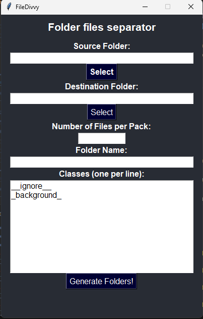
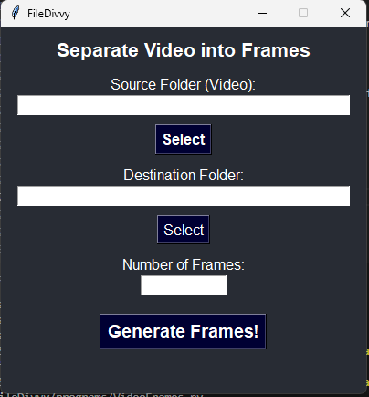

# FileDivvy - folder partition files separator 🖼 📝 ⚙️

Program that takes a folder with several files and separates it into several folders with the defined number of files. This program helps anyone who wants to organize their datasets for annotation, for users of the labelme program.

Run -> python FileDivvyApp.py.py

SEPARATOR FOLDERS AND FILES

1 - Origin Folder -> Select directory that contains the images

2 - Destination Folder -> Select the directory where the folders will be divided

3 - Number of Images per Package -> number of images in each folder

4 - Folder Names -> When dividing folders, they will be divided by name and at the end the ID '_0,_1,_2,...'

5 - Classes -> Add a new class for each line (after the _ignore___background command)

6 - Process -> Start partitioning folders

VIDEO PARTITION FRAMES

1 - Go to the source folder of the video

2 - choose the path where you will partition the frames

3 - Enter the number of frames to partition

4 - Execute(Processar)

