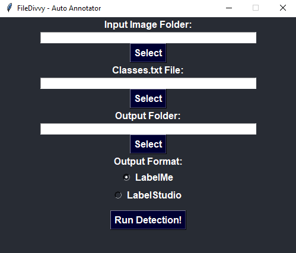

# 🖼️ FileDivvy – Image Splitter & Auto-Annotation Tool

**FileDivvy** is a desktop application to help organize and annotate image datasets efficiently. Whether you need to split large folders of images or generate bounding box annotations automatically using YOLOv8, FileDivvy simplifies the process.

## ⚙️ Features

- ✅ **Split image folders** into multiple subfolders, each with a fixed number of images.
- ✅ **Automatically annotate images** using a YOLOv8 model.
- ✅ Choose between **LabelMe** and **Label Studio** output formats.
- ✅ Simple and intuitive **graphical interface (GUI)** using Tkinter.

---

## 🚀 How to Run

```bash
python FileDivvyApp.py
```

> Requires Python 3.7+, `ultralytics`, `opencv-python`, and `tkinter`.

---

## 🧩 Function 1: Split Images into Subfolders

### Step-by-Step:

1. **Select the Input Folder**  
   Choose the folder that contains your image files.

2. **Select the Output Folder**  
   This is where the split folders will be created.

3. **Set Images per Folder**  
   Define how many images each subfolder should contain.

4. **Set Folder Name Prefix**  
   Subfolders will be named like `prefix_0`, `prefix_1`, etc.

5. **Click Process**  
   The tool will create and fill the folders accordingly.

---

## 🔍 Function 2: Auto-Annotate Images (Bounding Boxes)

### Step-by-Step:

1. **Select the Input Folder**  
   Choose the folder with images to annotate.

2. **Select the Classes File**  
   A `.txt` file with the class names you want to detect (one per line).

3. **Select the Output Folder**  
   Where the annotation `.json` files will be saved.

4. **Choose the Annotation Format**  
   - `LabelMe` – JSON format compatible with the LabelMe tool.  
   - `Label Studio` – JSON format for use with Label Studio.

5. **Click "Run Detection!"**  
   The YOLOv8 model will detect objects and create the annotation files.

> Only objects matching your selected classes (from the `.txt`) and with confidence ≥ 0.5 will be saved.

---

## 🧠 Under the Hood

- Uses the **YOLOv8n** model from the [Ultralytics](https://github.com/ultralytics/ultralytics) library.
- Supports `.jpg`, `.jpeg`, and `.png` formats.
- Runs detection in a separate thread to keep the GUI responsive.

---

## 📸 GUI Preview

**Main Interface:**  


**Image Folder Separator:**


**Labeler Annotation Auto:**


---

## 📁 Example Use Case

You're working with a huge dataset of images for a computer vision project. With FileDivvy, you can:

- Split the dataset into smaller, labeled chunks for better organization or parallel labeling.
- Auto-generate bounding box annotations with one click.
- Export to your favorite annotation tool format.
